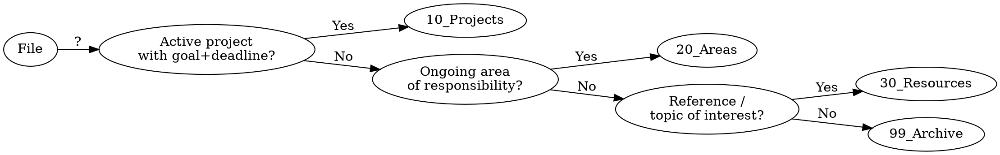

# PARA File Organizer

Organizes any Obsidian vault folder using Tiago Forte's PARA method. **Default: dry-run only — never move files without explicit user approval.**

## PARA Folder Naming

| # | Folder | Contents |
|---|--------|----------|
| 00 | `00_INBOX/` | Unsorted inbox |
| 10 | `10_Projects/` | Active work with a deadline/goal |
| 20 | `20_Areas/` | Ongoing responsibilities (no end date) |
| 30 | `30_Resources/` | Reference material and topics of interest |
| 99 | `99_Archive/` | Completed projects / inactive resources |

Subfolder names: concrete instance names only (e.g. `Portfolio-Site`, `Health`, `Web-Dev-Resources`). **No `Stuff`, `Misc`, or `Things`.**

## Classification Order (actionability first)



**When in doubt, classify into the more actionable category (higher up).**

## Workflow (ALWAYS follow this order)

```
STEP 1 — Scan target folder
STEP 2 — Dry-run output (list every proposed move + 1-line reason)
STEP 3 — Flag ambiguous files as questions (see Ask vs Decide)
STEP 4 — Wait for user approval ("Yes" / "No" / per-file feedback)
STEP 5 — Execute approved moves only
STEP 6 — Post-execution summary
```

**Never skip Step 4. Never move a file before explicit approval.**

## Ask vs Decide

| Situation | Action |
|-----------|--------|
| Project vs Area is ambiguous (finance, legal, tax, deadline unclear) | **ASK** |
| Screenshot purpose unidentifiable from filename + content | **ASK** |
| File unreadable (encrypted, corrupted, unsupported format) | **ASK** |
| File belongs to multiple active projects | **ASK** |
| Filename + content maps clearly to one PARA category | **DECIDE autonomously** |
| Clearly ephemeral (meme, notification screenshot, temp download) | **DECIDE → 99_Archive** |

## Dry-run Output Format

```
## 🗂 PARA Dry-run — [target folder]

### Proposed Moves
| File | → Destination | Reason |
|------|--------------|--------|
| job-offer-review.md | 10_Projects/Job-Search/ | Active decision with deadline |
| health-habits.md | 20_Areas/Health/ | Ongoing maintenance, no end date |
| rust-notes.md | 30_Resources/Rust/ | Reference interest, no active goal |
| 2023-tax-return.pdf | 99_Archive/ | Completed, past year |

### ❓ Needs Clarification
- `budget-2025.md` — Project (Q1 planning) or Area (ongoing finance)?

### 🏗 Subfolder Proposals
- `10_Projects/` has 6 files on "job search" theme → create `10_Projects/Job-Search/`

### ⚠️ Anti-pattern Alerts
- `10_Projects/2025/` is empty → propose deletion
- `20_Areas/Stuff/` — ambiguous name → propose rename

Proceed with all approved moves? (Yes / No / specify per file)
```

## Subfolder Proposals

Propose a new subfolder when **5 or more files** share the same theme in one PARA category or INBOX.
- Name = one concrete instance (`Q1-Launch`, `Health`, `Web-Dev-Resources`)
- Propose in dry-run; create only after approval

## Anti-pattern Detection

Detect and propose fixes for all of these:

| Anti-pattern | Example | Proposal |
|-------------|---------|----------|
| Empty intermediate folder | `10_Projects/2026/` (empty) | Delete |
| Single-child category | `10_Projects/Work/Q1/` only child | Remove `Work/` layer |
| Ambiguous name | `20_Areas/Stuff/` | Rename to specific instance |
| Pre-emptive empty folder | Empty folder for future project | Delete; create when needed |
| Meaningless deep nesting | `10_Projects/A/B/C/note.md` | Flatten to `10_Projects/A/note.md` |

## Wikilink Safety

- **Folder-only moves**: Obsidian resolves `[[wikilinks]]` by filename → no action needed
- **File renames**: Alert user before proceeding; check for a vault-wide rename script first
- **New links**: Always use `[[wikilink]]` syntax, never `[text](path)` markdown links

## Frontmatter (optional, on approval)

For files **without** existing frontmatter, offer to add:

```yaml
---
title: <derived from filename>
created: <file creation date>
tags: []
---
```
Never modify existing frontmatter.

## Completion Summary

After execution, report:

```
## ✅ PARA Organization Complete

- Projects: N files
- Areas:    N files
- Resources: N files
- Archive:  N files

Subfolders created: [list]
Structure changes:  [list]

Judgment calls (ambiguous → decided): [list with reasoning]
User-confirmed items: [list]
Still pending / skipped: [list]
```

## Scope

**In:** File classification, PARA category assignment, actionability evaluation, Ask vs Decide decisions, subfolder proposals (5+ file threshold), anti-pattern detection + proposals, dry-run → approval → execution flow, completion summary.

**Out:** AI summarization / auto-tagging, duplicate detection, backups, plugin-specific features (Bases, Canvas), vault-wide restructuring beyond PARA categories.

For detailed classification examples and edge cases, see [classification-rules.md](classification-rules.md).
